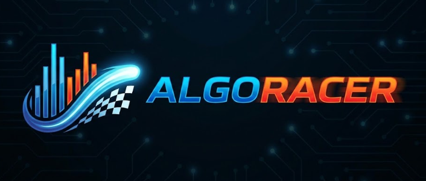
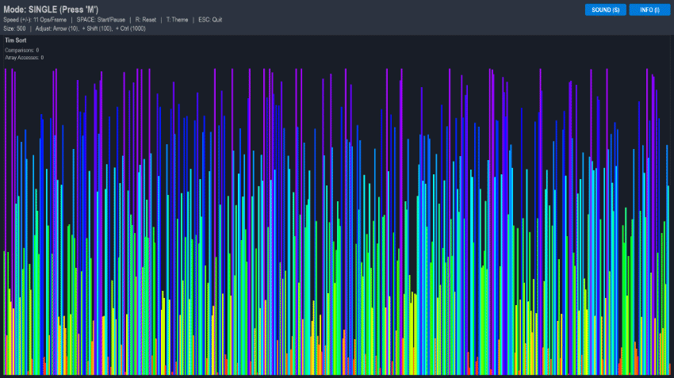
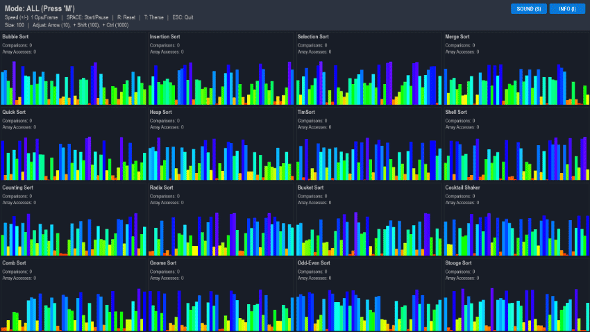
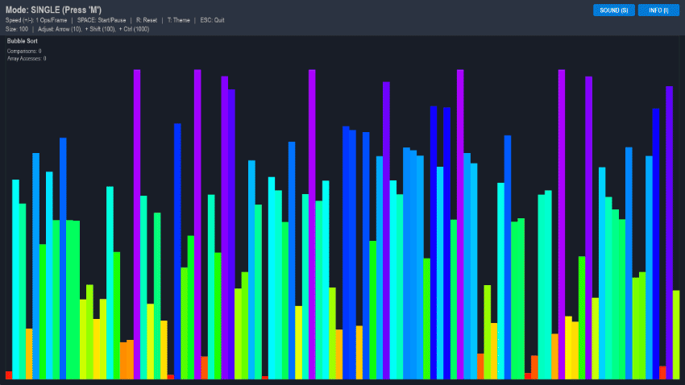
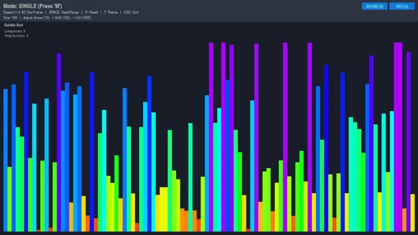
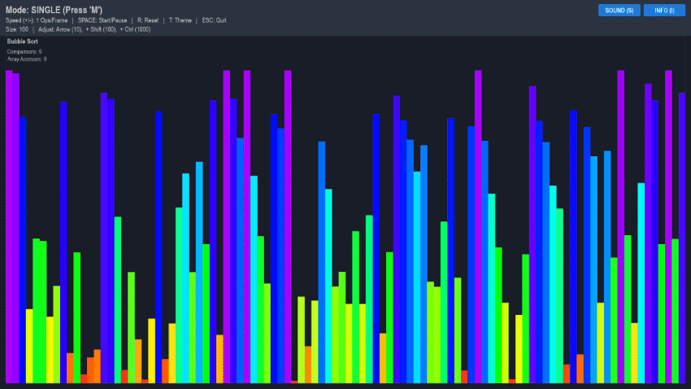

<div align="center">
   
  <br><br>

  <p>
    
    
    
    
  </p>
  
  <p>
    <b>AlgoRacer</b> is an interactive, multi-sensory educational tool designed to demystify sorting algorithms.
  </p>

  <br>
  
  
</div>

---

## Key Features

### Race Mode (Grid View)
Run up to 16 algorithms concurrently on a 4x4 grid to compare efficiency visually. 

<div align="center">
  
</div>

### Auditory Feedback Engine
Uses `NumPy` to generate procedural sine waves. 
The pitch corresponds to the element's value; sorted arrays "sing," while random arrays sound like static.

### Educational Overlay
Built-in "Cheat Sheet" pop-up detailing Time/Space Complexity, Stability, and Use Cases for every algorithm.

---

## Interactive Controls

AlgoRacer offers granular control over the visualization environment.

### 1. Dynamic Speed Control
Adjust execution speed in real-time using exponential scaling. 
* **Keys:** `+` (Increase) / `-` (Decrease)

<div align="center">
  
</div>

### 2. Array Size Manipulation
Dynamically resize the dataset. 
* **Fine Tune:** `Arrow Keys` (±10)
* **Fast Tune:** `Shift + Arrows` (±100)
* **Turbo Tune:** `Ctrl + Arrows` (±1000)

<div align="center">
  
</div>

### 3. General Management
Full control over the simulation state including themes, audio, and resetting.
* **Space:** Start/Pause
* **R:** Reset
* **T:** Toggle Theme
* **S:** Mute/Unmute
* **I:** Info Sheet

<div align="center">
  
</div>

---

## Installation & Usage

### Option A: Quick Start (No Install Required)
The easiest way to try AlgoRacer is to download the standalone executable. 
You do **not** need Python installed.

1.  Navigate to the **[Releases](../../releases)** section on the right sidebar of this repository.
2.  Download the latest `AlgoRacer.exe`.
3.  Double-click the file to launch the visualizer immediately.

### Option B: Run from Source (For Developers)
If you want to modify the code or run it raw:

1.  **Clone the Repository**
    ```bash
    git clone https://github.com/Ryu-134/AlgoRacer.git
    cd AlgoRacer
    ```

2.  **Install Dependencies**
    ```bash
    pip install -r requirements.txt
    ```
    *(Requires `pygame` and `numpy`)*

3.  **Run the Application**
    ```bash
    python main.py
    ```

---

## Master Keybindings Reference

| Key | Action |
| :--- | :--- |
| **SPACE** | Start / Pause Sorting |
| **R** | Reset Array (New Random Seed) |
| **M** | Toggle Mode (Single vs. Grid Race) |
| **T** | Toggle Theme (Dark / Light) |
| **S** | Toggle Sound (Mute/Unmute) |
| **I** | Toggle Info Sheet (Complexities & Notes) |
| **+/-** | Increase / Decrease Speed (Exponential) |
| **Arrows** | Adjust Array Size (±10) |
| **Shift + Arrows** | Adjust Array Size (±100) |
| **Ctrl + Arrows** | Adjust Array Size (±1000) |
| **Left / Right** | Cycle Algorithm (Single Mode) |

---

## Engineering Highlights

### 1. Coroutine-Based State Management
Instead of blocking the main thread, all sorting algorithms are implemented as Python **Generators** (`yield`).
* This allows the `Pygame` event loop to remain responsive (60 FPS) while the algorithm "pauses" execution to let the screen draw.

```python
# Example of Generator Pattern
def bubble_sort(arr):
    for i in range(len(arr)):
        if arr[i] > arr[i+1]:
            swap(arr, i, i+1)
            yield True # Return control to Main Loop to render frame

```

### 2. Procedural Sound Generation

Avoid loading hundreds of `.wav` files by synthesizing audio on the fly using `NumPy` to ensures low memory usage & infinite pitch granularity.

---

## Algorithms Included

This project includes a comprehensive suite of algorithms to demonstrate various complexity classes:

| Algorithm | Best | Average | Worst | Stable? |
| --- | --- | --- | --- | --- |
| **Quick Sort** | O(n log n) | O(n log n) | O(n²) | ❌ |
| **Merge Sort** | O(n log n) | O(n log n) | O(n log n) | ✅ |
| **Tim Sort** | O(n) | O(n log n) | O(n log n) | ✅ |
| **Heap Sort** | O(n log n) | O(n log n) | O(n log n) | ❌ |
| **Bubble Sort** | O(n) | O(n²) | O(n²) | ✅ |
| **Insertion Sort** | O(n) | O(n²) | O(n²) | ✅ |
| **Selection Sort** | O(n²) | O(n²) | O(n²) | ❌ |
| **Radix Sort** | O(nk) | O(nk) | O(nk) | ✅ |
| **Bucket Sort** | O(n+k) | O(n+k) | O(n²) | ✅ |
| **Counting Sort** | O(n+k) | O(n+k) | O(n+k) | ✅ |
| **Shell Sort** | O(n log n) | O(n⁴/³) | O(n²) | ❌ |
| **Cocktail Shaker** | O(n) | O(n²) | O(n²) | ✅ |
| **Comb Sort** | O(n log n) | O(n²) | O(n²) | ❌ |
| **Gnome Sort** | O(n) | O(n²) | O(n²) | ✅ |
| **Odd-Even Sort** | O(n) | O(n²) | O(n²) | ✅ |
| **Stooge Sort** | O(n^2.7) | O(n^2.7) | O(n^2.7) | ❌ |

---

## Project Structure

```text
AlgoRacer/
├── assets/              # GIFs and Images for documentation
├── main.py              # Entry point and Event Loop
├── algorithms.py        # Logic for all 16 sorting algorithms
├── visualizer.py        # UI rendering and State management
├── sound_manager.py     # NumPy audio generation engine
├── settings.py          # Configuration constants and Themes
└── requirements.txt     # Project dependencies

```

---

*Created by Casey Dane - 2025*
